# Markdown# Revisão Completa: Diagramas UML

## Índice
1. [Diagramas de Casos de Uso](#diagramas-de-casos-de-uso)
2. [Diagrama de Classes](#diagrama-de-classes)
3. [Modelo Conceitual e Diagrama de Transição de Estados](#modelo-conceitual-e-diagrama-de-transição-de-estados)
4. [Diagrama de Atividades](#diagrama-de-atividades)
5. [Diagrama de Sequência](#diagrama-de-sequência)

---

## Diagramas de Casos de Uso

### O que é?
O Diagrama de Casos de Uso é uma representação visual que descreve as **funcionalidades do sistema** do ponto de vista do **usuário**. Ele mostra a interação entre atores externos e o sistema, focando no **"o que"** o sistema faz, não no **"como"**.

### Elementos Principais

#### 1. **Ator (Actor)**
- Representa um usuário, sistema externo ou dispositivo que interage com o sistema
- Desenhado como um boneco palito (stick figure) ou caixa com `<<actor>>`
- Pode ser:
  - **Primário**: inicia a interação
  - **Secundário**: fornece serviços ao sistema

#### 2. **Caso de Uso (Use Case)**
- Representa uma funcionalidade ou serviço do sistema
- Desenhado como uma elipse/oval
- Nome deve começar com verbo no infinitivo (ex: "Realizar Login", "Processar Pagamento")

#### 3. **Sistema (System Boundary)**
- Retângulo que delimita o escopo do sistema
- Tudo dentro é parte do sistema; fora são atores externos

#### 4. **Relacionamentos**

**a) Associação (Association)**
- Linha sólida simples entre ator e caso de uso
- Indica que o ator participa do caso de uso

**b) Inclusão (Include) - `<<include>>`**
- Seta tracejada com estereótipo `<<include>>`
- Indica que um caso de uso **SEMPRE** inclui o comportamento de outro
- Usado para extrair comportamento comum
- Exemplo: "Fazer Pedido" `<<include>>` "Validar Estoque"

**c) Extensão (Extend) - `<<extend>>`**
- Seta tracejada com estereótipo `<<extend>>`
- Indica comportamento **OPCIONAL** ou **CONDICIONAL**
- O caso de uso estendido pode ou não ser executado
- Exemplo: "Realizar Pagamento" `<<extend>>` "Aplicar Cupom de Desconto"

**d) Generalização (Generalization)**
- Seta sólida apontando para o caso de uso ou ator mais geral
- Representa herança/especialização
- Exemplo: "Pagamento com Cartão" → "Realizar Pagamento"

### Exemplo Visual: Sistema de E-commerce

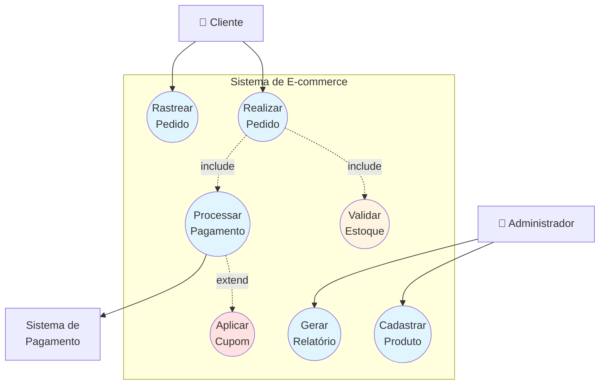

### Quando Usar?
- **Levantamento de requisitos**: identificar funcionalidades necessárias
- **Comunicação com stakeholders**: linguagem visual simples
- **Planejamento de projeto**: definir escopo e prioridades
- **Documentação de alto nível**: visão geral do sistema

### Boas Práticas
✅ Manter casos de uso simples e focados em uma única funcionalidade
✅ Usar verbos no infinitivo para nomear casos de uso
✅ Identificar todos os atores relevantes
✅ Evitar detalhes de implementação
✅ Usar `<<include>>` para comportamento obrigatório compartilhado
✅ Usar `<<extend>>` para funcionalidades opcionais

❌ Não incluir fluxos de dados ou lógica de negócio detalhada
❌ Não confundir casos de uso com funções técnicas
❌ Não usar termos técnicos incompreensíveis para stakeholders

---

## Diagrama de Classes

### O que é?
O Diagrama de Classes é o **diagrama mais importante** da UML. Ele representa a **estrutura estática** do sistema, mostrando classes, seus atributos, métodos e os relacionamentos entre elas. É a base para a implementação orientada a objetos.

### Estrutura de uma Classe

```
┌─────────────────────────┐
│      NomeDaClasse       │  ← Nome da classe (CamelCase)
├─────────────────────────┤
│ - atributoPrivado       │  ← Atributos
│ + atributoPublico       │     - privado
│ # atributoProtegido     │     + público
│ ~ atributoPacote        │     # protegido
├─────────────────────────┤     ~ pacote
│ + metodoPublico()       │  ← Métodos/Operações
│ - metodoPrivado()       │
│ + getAtributo(): tipo   │
└─────────────────────────┘
```

### Tipos de Classes

#### 1. **Classe Concreta**
- Pode ser instanciada
- Nome em texto normal

#### 2. **Classe Abstrata**
- Não pode ser instanciada
- Nome em **itálico** ou com `{abstract}`
- Contém métodos abstratos

#### 3. **Interface**
- Contrato que classes devem implementar
- Estereótipo `<<interface>>`
- Apenas métodos (sem implementação)

### Relacionamentos entre Classes

#### 1. **Associação (Association)**
- Linha sólida conectando duas classes
- Representa relacionamento estrutural
- **Multiplicidade**: indica quantos objetos podem participar
  - `1` → exatamente um
  - `0..1` → zero ou um
  - `*` ou `0..*` → zero ou muitos
  - `1..*` → um ou muitos
  - `n..m` → entre n e m

```
Cliente ────────── Pedido
       1      0..*
```
*"Um cliente pode fazer zero ou muitos pedidos"*

#### 2. **Agregação (Aggregation)**
- Losango branco na classe "todo"
- Relacionamento "tem-um" (has-a) **fraco**
- As partes podem existir independentemente do todo
- Exemplo: Departamento ◇──── Funcionário

```
Departamento ◇────── Funcionário
```
*"Funcionário pode existir sem o Departamento"*

#### 3. **Composição (Composition)**
- Losango preto na classe "todo"
- Relacionamento "tem-um" (has-a) **forte**
- As partes não existem sem o todo
- Exemplo: Casa ◆──── Cômodo

```
Casa ◆────── Cômodo
```
*"Cômodo não existe sem a Casa"*

#### 4. **Herança/Generalização (Inheritance)**
- Seta triangular branca apontando para a superclasse
- Relacionamento "é-um" (is-a)
- Representa especialização/generalização

```
         Animal
           △
           │
    ┌──────┼──────┐
  Cachorro │   Gato
```

#### 5. **Realização/Implementação**
- Linha tracejada com seta triangular branca
- Classe implementa uma interface

```
<<interface>>
   Voador
      △
      ┊
   Passaro
```

#### 6. **Dependência (Dependency)**
- Linha tracejada com seta simples
- Relacionamento mais fraco
- Uma classe usa outra temporariamente
- Exemplo: método recebe parâmetro de outro tipo

```
Pedido ┄┄┄> EmailService
```

### Exemplo Visual: Sistema de Biblioteca

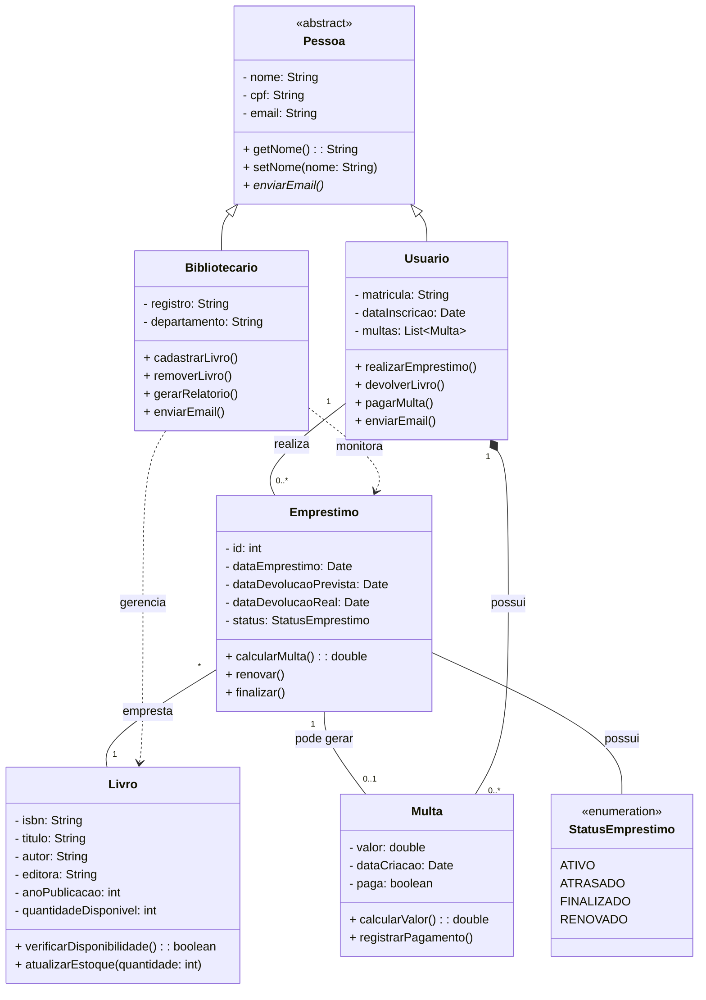

### Exemplo Adicional: Sistema Bancário

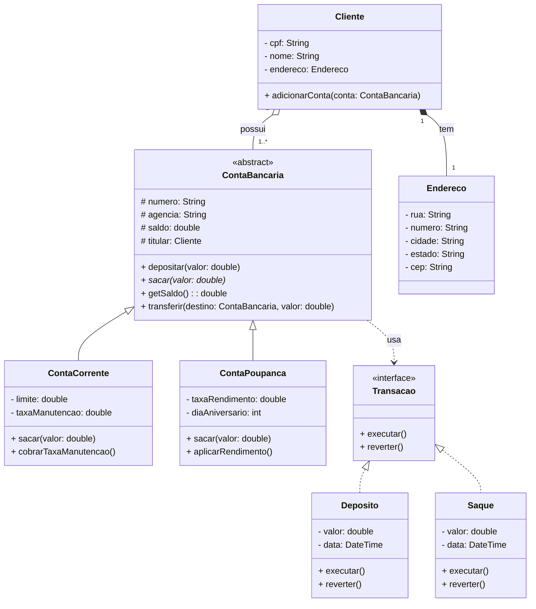

### Quando Usar?
- **Design de sistema**: planejar estrutura de classes
- **Documentação**: mostrar arquitetura do código
- **Comunicação técnica**: entre desenvolvedores
- **Geração de código**: ferramentas podem gerar código a partir do diagrama
- **Refatoração**: visualizar impacto de mudanças

### Boas Práticas
✅ Usar nomes significativos e autoexplicativos
✅ Seguir princípios SOLID
✅ Especificar visibilidade corretamente (+, -, #, ~)
✅ Incluir multiplicidade nos relacionamentos
✅ Usar tipos de dados claros
✅ Separar responsabilidades adequadamente
✅ Documentar classes abstratas e interfaces claramente

❌ Não incluir getters/setters óbvios (poluem o diagrama)
❌ Não criar classes "deus" (com muitas responsabilidades)
❌ Não usar relacionamentos incorretos
❌ Não misturar níveis de abstração diferentes

---

## Modelo Conceitual e Diagrama de Transição de Estados

### Modelo Conceitual (MER - Modelo Entidade Relacionamento)

#### O que é?
O Modelo Conceitual é uma representação abstrata e de **alto nível** dos dados do sistema, focada na **estrutura de informação** independente de tecnologia. É a base para o design de banco de dados.

#### Elementos Principais

**1. Entidade**
- Representa um objeto do mundo real que queremos armazenar informações
- Desenhada como retângulo
- Exemplo: Cliente, Produto, Pedido

**2. Atributo**
- Característica ou propriedade de uma entidade
- Desenhado como elipse conectada à entidade
- Tipos:
  - **Simples**: não divisível (ex: nome)
  - **Composto**: divisível (ex: endereço = rua + número + cidade)
  - **Derivado**: calculado a partir de outros (ex: idade a partir de data nascimento)
  - **Multivalorado**: pode ter múltiplos valores (ex: telefones)

**3. Atributo Chave (Primary Key)**
- Identifica unicamente uma entidade
- Sublinhado ou destacado

**4. Relacionamento**
- Associação entre entidades
- Desenhado como losango
- Tem cardinalidade: 1:1, 1:N, N:M

**5. Cardinalidade**
- **1:1** (um para um): Um marido para uma esposa
- **1:N** (um para muitos): Um cliente faz muitos pedidos
- **N:M** (muitos para muitos): Muitos estudantes cursam muitas disciplinas

#### Exemplo Visual: Modelo Conceitual de Universidade

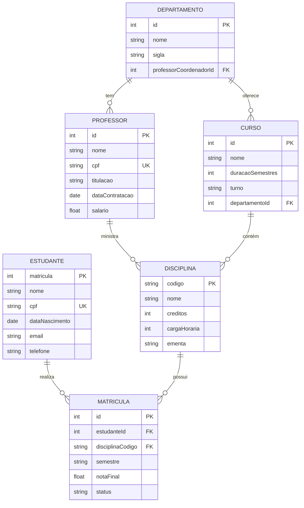

---

### Diagrama de Transição de Estados

#### O que é?
O Diagrama de Transição de Estados (State Machine Diagram) modela o **comportamento dinâmico** de um objeto, mostrando os diferentes **estados** pelos quais ele pode passar e os **eventos** que causam essas transições.

#### Elementos Principais

**1. Estado (State)**
- Representa uma condição ou situação durante a vida de um objeto
- Desenhado como retângulo com cantos arredondados
- Nome geralmente é adjetivo ou particípio

**2. Estado Inicial (Initial State)**
- Círculo preto preenchido
- Indica onde o objeto começa
- Apenas um por diagrama

**3. Estado Final (Final State)**
- Círculo preto com círculo ao redor
- Indica término do ciclo de vida
- Pode ter múltiplos

**4. Transição (Transition)**
- Seta que conecta estados
- Formato: `evento [guarda] / ação`
  - **Evento**: o que desencadeia a mudança
  - **[Guarda]**: condição opcional
  - **/Ação**: operação executada durante a transição

**5. Auto-transição (Self-transition)**
- Seta que sai e retorna ao mesmo estado
- Representa evento que não muda o estado

#### Exemplo Visual: Estados de um Pedido

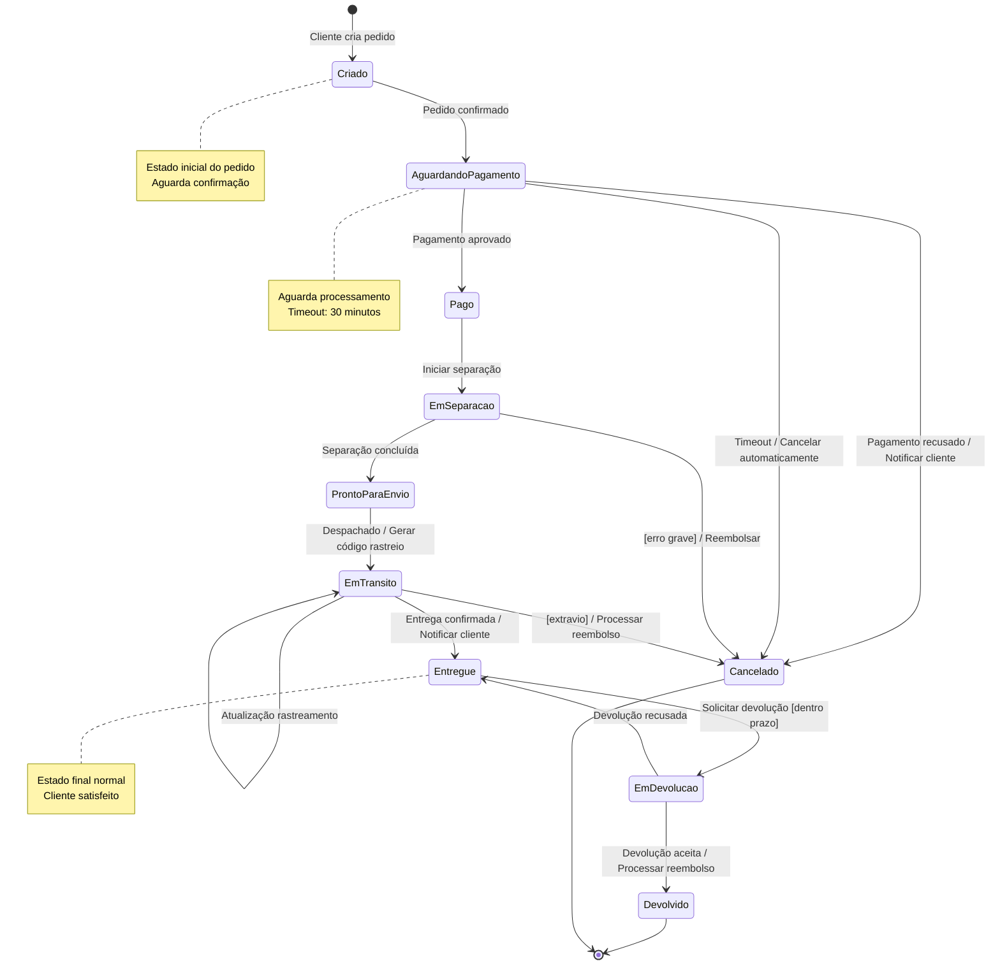

#### Exemplo Visual: Estados de uma Conexão de Rede

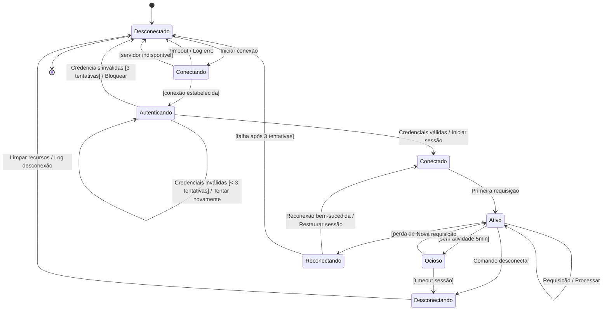

#### Exemplo: Estados de uma Conta de Usuário

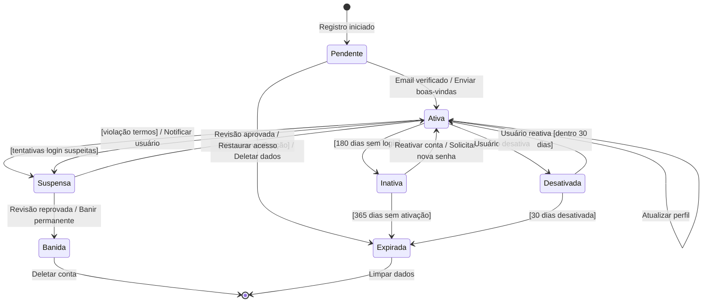

### Quando Usar?

**Modelo Conceitual:**
- Design de banco de dados
- Levantamento de requisitos de dados
- Documentação de estrutura de informação
- Análise de domínio do negócio

**Diagrama de Estados:**
- Modelar objetos com comportamento complexo
- Sistemas reativos (respondem a eventos)
- Protocolos de comunicação
- Workflows com múltiplos estados
- Ciclos de vida de entidades importantes

### Boas Práticas

**Modelo Conceitual:**
✅ Identificar todas as entidades relevantes do domínio
✅ Normalizar para evitar redundância
✅ Definir cardinalidades corretamente
✅ Documentar regras de negócio
✅ Usar nomes significativos

**Diagrama de Estados:**
✅ Identificar todos os estados possíveis
✅ Nomear estados com adjetivos/particípios
✅ Definir claramente as condições de transição
✅ Incluir estados de erro
✅ Evitar estados desnecessários
✅ Garantir que todo estado seja alcançável

❌ Não criar estados ambíguos
❌ Não esquecer de modelar estados de exceção
❌ Não criar transições impossíveis

---

## Diagrama de Atividades

### O que é?
O Diagrama de Atividades modela o **fluxo de trabalho** (workflow) de um processo ou algoritmo. Ele é similar a um fluxograma, mas mais poderoso, mostrando ações sequenciais e paralelas, decisões, loops e sincronização.

### Elementos Principais

#### 1. **Nó Inicial (Initial Node)**
- Círculo preto preenchido
- Início do fluxo
- Apenas um por diagrama

#### 2. **Nó Final (Final Node)**
- Círculo preto com círculo ao redor
- **Activity Final**: termina todo o fluxo
- **Flow Final**: termina apenas um subfluxo (círculo com X)

#### 3. **Ação/Atividade (Action/Activity)**
- Retângulo com cantos arredondados
- Representa uma tarefa ou operação
- Nome em verbo + objeto

#### 4. **Decisão (Decision Node)**
- Losango
- Múltiplas saídas com condições `[condição]`
- Apenas uma saída é seguida
- Similar ao "if-else"

#### 5. **Merge (Merge Node)**
- Losango que une múltiplos fluxos
- Não é sincronização (não espera)
- Continua assim que um fluxo chegar

#### 6. **Fork (Parallel Split)**
- Barra horizontal/vertical preta
- **Divide** o fluxo em múltiplos fluxos paralelos
- Execução simultânea

#### 7. **Join (Synchronization)**
- Barra horizontal/vertical preta
- **Une** múltiplos fluxos paralelos
- **Espera** todos os fluxos chegarem antes de continuar

#### 8. **Raias (Swimlanes)**
- Divisões verticais ou horizontais
- Representam responsáveis (atores, sistemas, departamentos)
- Mostram quem executa cada atividade

### Exemplo Visual: Processo de Compra Online

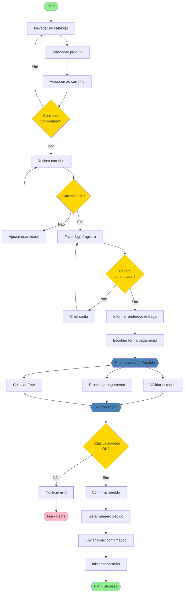

### Exemplo com Raias: Processo de Aprovação de Férias

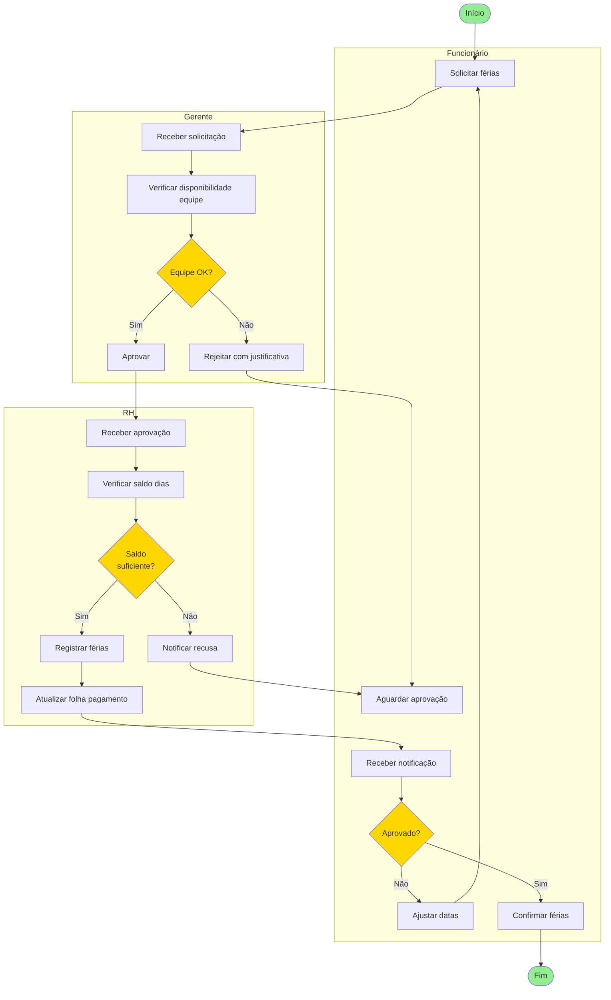

### Exemplo: Algoritmo de Login com Tentativas

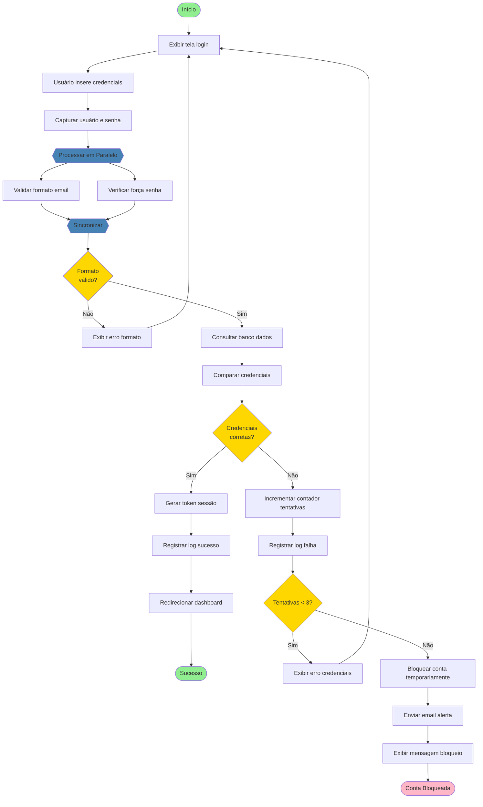

### Quando Usar?
- **Modelar processos de negócio**: workflows empresariais
- **Documentar algoritmos**: lógica de programação complexa
- **Análise de requisitos**: entender fluxo de atividades
- **Processos com paralelismo**: tarefas simultâneas
- **Automação**: mapear processos para automatizar

### Boas Práticas
✅ Usar verbos de ação para nomear atividades
✅ Manter fluxo da esquerda para direita, cima para baixo
✅ Usar raias para mostrar responsabilidades
✅ Indicar claramente condições nas decisões
✅ Sincronizar adequadamente fluxos paralelos
✅ Incluir cenários de exceção e erro
✅ Evitar complexidade excessiva - dividir em subdiagramas se necessário

❌ Não misturar níveis de abstração diferentes
❌ Não criar loops infinitos
❌ Não esquecer de unir fluxos paralelos (join)
❌ Não usar decisões ambíguas

---

## Diagrama de Sequência

### O que é?
O Diagrama de Sequência modela a **interação entre objetos ao longo do tempo**, mostrando a **troca de mensagens** em ordem cronológica. É o diagrama de interação mais importante e detalhado da UML.

### Elementos Principais

#### 1. **Ator (Actor)**
- Representa um usuário ou sistema externo
- Desenhado como boneco palito ou caixa

#### 2. **Objeto/Participante (Object/Participant)**
- Retângulo no topo do diagrama
- Formato: `nomeObjeto:NomeClasse` ou apenas `NomeClasse`
- Representa uma instância que participa da interação

#### 3. **Linha de Vida (Lifeline)**
- Linha vertical tracejada que desce do objeto
- Representa a existência do objeto ao longo do tempo

#### 4. **Barra de Ativação (Activation Bar)**
- Retângulo estreito sobre a linha de vida
- Indica quando o objeto está ativo/executando

#### 5. **Mensagens (Messages)**

**a) Mensagem Síncrona**
- Seta cheia →
- Remetente **espera** resposta antes de continuar
- Chamada de método normal

**b) Mensagem Assíncrona**
- Seta aberta →
- Remetente **não espera** resposta
- Continua imediatamente

**c) Mensagem de Retorno**
- Seta tracejada ← - -
- Retorno de uma chamada
- Opcional (geralmente implícito)

**d) Mensagem de Criação**
- Seta apontando para o objeto sendo criado
- Estereótipo `<<create>>`

**e) Mensagem de Destruição**
- Seta para um X no fim da linha de vida
- Estereótipo `<<destroy>>`

#### 6. **Fragmentos de Interação**

**a) `alt` (Alternative) - IF/ELSE**
```
alt [condição verdadeira]
    mensagens quando verdadeiro
else [condição falsa]
    mensagens quando falso
end
```

**b) `opt` (Optional) - IF sem ELSE**
```
opt [condição]
    mensagens opcionais
end
```

**c) `loop` (Loop) - Repetição**
```
loop [condição ou contador]
    mensagens repetidas
end
```

**d) `par` (Parallel) - Execução paralela**
```
par
    mensagens em paralelo
and
    outras mensagens em paralelo
end
```

**e) `ref` (Reference) - Referência a outro diagrama**
```
ref Outro Diagrama
```

### Exemplo Visual: Sistema de Login

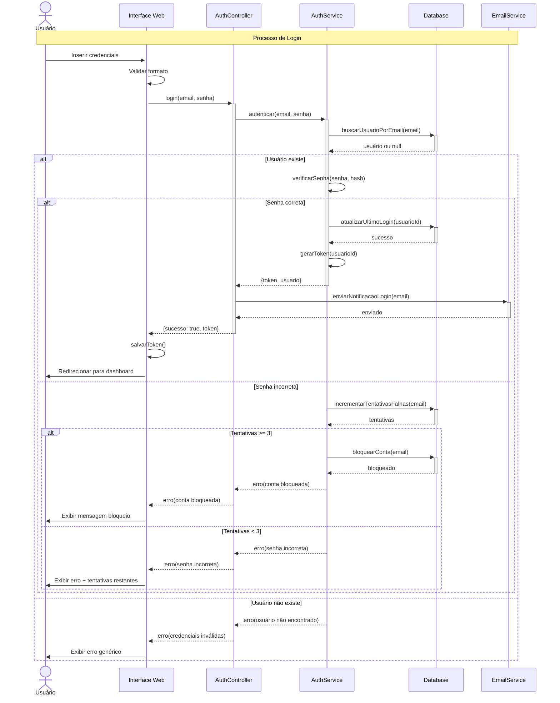

### Exemplo: Processamento de Pedido E-commerce

```mermaid
sequenceDiagram
    actor C as Cliente
    participant FE as Frontend
    participant BE as Backend API
    participant OS as OrderService
    participant PS as PaymentService
    participant IS as InventoryService
    participant NS as NotificationService
    participant DB as Database
    participant PG as Payment Gateway
    
    Note over C,PG: Fluxo de Criação de Pedido
    
    C->>+FE: Clicar "Finalizar Compra"
    FE->>FE: Validar carrinho
    
    FE->>+BE: POST /api/orders
    BE->>+OS: criarPedido(dadosPedido)
    
    OS->>+DB: iniciarTransacao()
    
    par Validações Paralelas
        OS->>+IS: verificarEstoque(produtos)
        IS->>DB: SELECT estoque
        DB-->>IS: dados estoque
        IS-->>-OS: estoqueDisponivel
    and
        OS->>+PS: validarDadosPagamento(cartao)
        PS-->>-OS: dadosValidos
    end
    
    alt Estoque suficiente E Dados válidos
        
        OS->>+DB: INSERT pedido
        DB-->>-OS: pedidoId
        
        OS->>+IS: reservarEstoque(produtos, pedidoId)
        IS->>DB: UPDATE estoque
        DB-->>IS: sucesso
        IS-->>-OS: estoque reservado
        
        OS->>+PS: processarPagamento(pedidoId, valor, cartao)
        PS->>+PG: chargeCard(dados)
        
        PG-->>-PS: transactionId
        
        alt Pagamento Aprovado
            PS->>DB: INSERT transacao
            PS-->>-OS: pagamentoAprovado(transactionId)
            
            OS->>DB: UPDATE pedido status='PAGO'
            OS->>DB: commitTransacao()
            
            loop Para cada produto
                OS->>IS: confirmarReserva(produtoId)
            end
            
            par Notificações Assíncronas
                OS->>NS: enviarEmailConfirmacao(pedidoId)
                NS-->>OS: enfileirado
            and
                OS->>NS: enviarSMS(telefone, codigo)
                NS-->>OS: enfileirado
            end
            
            OS-->>-BE: pedidoCriado(pedidoId, dados)
            BE-->>-FE: 201 Created {pedidoId}
            FE->>C: Exibir confirmação
            
        else Pagamento Recusado
            PS-->>OS: pagamentoRecusado(motivo)
            
            OS->>IS: liberarEstoque(produtos)
            OS->>DB: DELETE pedido
            OS->>DB: rollbackTransacao()
            
            OS-->>BE: erro(pagamento recusado)
            BE-->>FE: 402 Payment Required
            FE->>C: Exibir erro pagamento
        end
        
    else Estoque insuficiente OU Dados inválidos
        OS->>DB: rollbackTransacao()
        
        alt Estoque insuficiente
            OS-->>BE: erro(estoque insuficiente)
            BE-->>FE: 409 Conflict
            FE->>C: Produtos indisponíveis
        else Dados inválidos
            OS-->>BE: erro(dados inválidos)
            BE-->>FE: 400 Bad Request
            FE->>C: Corrigir informações
        end
    end
    
    deactivate OS
```

### Exemplo: Integração com Sistema Externo via API

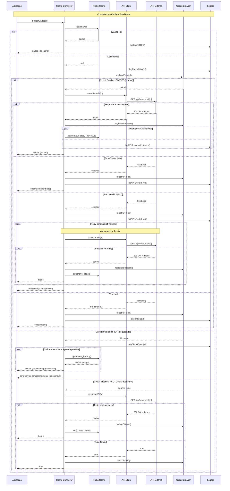

### Quando Usar?
- **Design detalhado**: especificar interações entre classes
- **Documentação de APIs**: mostrar fluxo de chamadas
- **Debugging**: entender ordem de execução
- **Análise de performance**: identificar gargalos
- **Integração de sistemas**: documentar comunicação entre serviços
- **Casos de uso complexos**: detalhar cenários específicos

### Boas Práticas
✅ Ordenar objetos da esquerda para direita por ordem de participação
✅ Usar fragmentos de interação para lógica condicional
✅ Incluir cenários de erro e exceção
✅ Nomear mensagens com verbos de ação
✅ Mostrar retornos apenas quando necessário para clareza
✅ Usar notas para explicar decisões importantes
✅ Agrupar interações relacionadas

❌ Não incluir muitos objetos (máximo 7-8 por diagrama)
❌ Não misturar níveis de abstração
❌ Não omitir mensagens críticas
❌ Não criar diagramas muito longos (dividir em subdiagramas)

---

## Resumo Comparativo

| Diagrama | Foco Principal | Quando Usar | Nível |
|----------|----------------|-------------|-------|
| **Casos de Uso** | Funcionalidades do sistema | Levantamento requisitos, comunicação stakeholders | Alto |
| **Classes** | Estrutura estática | Design de código, arquitetura | Médio/Baixo |
| **Estados** | Comportamento de objeto individual | Objetos com ciclo de vida complexo | Médio |
| **Atividades** | Fluxo de trabalho | Processos de negócio, algoritmos | Alto/Médio |
| **Sequência** | Interação temporal entre objetos | Design detalhado, integração | Baixo |
| **Modelo Conceitual** | Estrutura de dados | Design de banco de dados | Alto |

---

## Dicas Gerais de Modelagem UML

### Princípios Fundamentais
1. **Abstração**: Focar no essencial, omitir detalhes desnecessários
2. **Clareza**: Diagramas devem ser fáceis de entender
3. **Consistência**: Manter padrões entre diagramas
4. **Completude**: Cobrir todos os aspectos relevantes
5. **Correção**: Representar fielmente o sistema

### Processo de Modelagem
1. **Entender o problema**: antes de modelar, compreenda o domínio
2. **Escolher o diagrama certo**: cada tipo serve a um propósito
3. **Começar simples**: adicionar detalhes gradualmente
4. **Iterar**: revisar e refinar continuamente
5. **Validar**: verificar com stakeholders e equipe técnica

### Ferramentas Recomendadas
- **Lucidchart**: online, colaborativo
- **Draw.io**: gratuito, versátil
- **StarUML**: desktop, profissional
- **PlantUML**: baseado em texto, versionável
- **Enterprise Architect**: corporativo, completo
- **Visual Paradigm**: rico em recursos

---

## Conclusão

A UML é uma ferramenta poderosa para:
- ✅ **Comunicação**: linguagem comum entre equipes
- ✅ **Documentação**: registrar decisões de design
- ✅ **Planejamento**: visualizar antes de implementar
- ✅ **Análise**: identificar problemas antes do código
- ✅ **Manutenção**: facilitar entendimento do sistema

**Lembre-se**: Diagramas são **meios**, não **fins**. O objetivo é criar software de qualidade, não documentação perfeita. Use UML quando agregar valor, não por obrigação.

---

**Revisão criada para estudos de Análise e Projeto de Sistemas**
*Versão 1.0 - Novembro 2025* Editor Online - Free Live Preview 🚀

Welcome to **MarkdownLivePreview.dev** - the best **online markdown editor** with live preview! **Edit markdown online** for free with our powerful **markdown editor online** featuring real-time preview, LaTeX support, and advanced tools. Perfect for developers, writers, and technical documentation. No signup required - start using our **free online markdown editor** instantly!

[](https://digitalpro.dev)


## Why Choose Our Online Markdown Editor?

Our **markdown editor online** delivers the most powerful free editing experience available. Whether you need an **online markdown editor** with live preview, **markdown online editor** with file upload, or **markdown editor with preview** - our platform has everything you need:

- **🚀 Live Preview**: Real-time **markdown live preview** as you type
- **📁 File Upload**: Upload and edit existing .md files instantly  
- **📊 Table Generator**: Built-in [markdown table generator](/tools/table-generator) tool
- **🔢 LaTeX Math**: Full LaTeX equation support with live rendering
- **💾 Auto-Save**: Your work saves automatically to browser storage
- **📱 Mobile Ready**: Perfect **web markdown editor** for all devices
- **⚡ Instant Start**: No registration - start with our **free online markdown editor** now

> **Pro Tip**: Perfect for academic writing, technical documentation, and any content requiring **math in markdown**!

## Online Markdown Editor Features

Our **online markdown editor** is designed for maximum productivity and ease of use. Whether you're a developer, writer, or student, our **markdown editor online** provides everything you need:

**🎯 Perfect For:**
- 📋 GitHub README files and documentation
- 📝 Technical writing and blog posts
- 📊 Data tables with the built-in table generator
- 🎓 Academic papers with LaTeX equations
- 💼 Professional documentation and reports
- 🔗 Creating markdown links and formatting

**⚡ Key Features:**
- **Real-time preview** - See changes instantly
- **File upload support** - Edit existing markdown files
- **Syntax highlighting** - Beautiful code formatting
- **Export options** - Save as HTML, PDF, or download .md files

> **Tip**: Use our [tools suite](/tools) for specialized **markdown** tasks like table generation!

## Online Markdown Viewer & Editor

Need an **online markdown viewer**? Our **markdown online viewer** gives you instant preview of any markdown file. Upload, paste, or type directly into our **markdown editor with preview**:

**✨ Preview Support:**
- ✅ GitHub-flavored markdown syntax
- ✅ Tables with column alignment  
- ✅ Code syntax highlighting (20+ languages)
- ✅ LaTeX math equations and formulas
- ✅ Links, images, and media embedding
- ✅ Task lists and checkboxes

**🚀 Popular Uses:**
- Preview README.md files before GitHub commits
- Edit and preview technical documentation  
- Create formatted reports and presentations
- Write academic papers with mathematical notation
- Build markdown content for websites and blogs

> **💡 Quick Start**: Just start typing in the left pane to see your **live markdown preview** on the right!

---

## Start Editing Markdown Online Now!

**Ready to try the best online markdown editor?** Clear this text and start typing your own markdown content. Here's a sample to get you started:

```markdown
# My Project Documentation

Welcome to my project! This README was created using **MarkdownLivePreview.dev**.

## Quick Setup
1. Clone the repository
2. Install dependencies: `npm install`  
3. Start development: `npm run dev`

## Features
- ✅ **Real-time preview** while you edit
- ✅ **File upload support** for existing .md files
- ✅ **LaTeX equations**: $E = mc^2$
- ✅ **Table generator** for data formatting

| Feature | Status | Notes |
|---------|--------|-------|
| Editor | ✅ Live | Real-time preview |
| Upload | ✅ Ready | Drag & drop files |
| Export | ✅ Works | PDF, HTML, MD |

## Get Started
Visit [MarkdownLivePreview.dev](/) to start editing!
```

> **🎯 Pro Tip**: Replace this example content with your own markdown and watch the live preview update instantly!

## Master Markdown Syntax with Our Cheat Sheet

Learn **markdown** quickly with our comprehensive [markdown cheat sheet](/cheatsheet). Whether you're new to **markdown syntax** or need a quick reference, our **cheat sheet** covers everything from basic formatting to advanced features.

**Essential markdown syntax examples**:
- **Headers**: `# Heading 1`, `## Heading 2`
- **Bold in markdown**: `**bold text**` or `__bold text__`
- **Links in markdown**: `[Link Text](URL)`
- **Markdown tables**: `| Col 1 | Col 2 |`
- **Line breaks in markdown**: Use two spaces at the end
- **Code blocks**: ```language` for syntax highlighting

**Advanced markdown features**:
- Task lists with checkboxes
- **Markdown strikethrough**: `~~strikethrough~~`
- Nested lists and formatting
- **Markdown footnotes** for references

> **Bookmark this**: Our [markdown cheat sheet](/cheatsheet) is your complete **markdown guide**!

## Markdown Table Generator - Create Tables Effortlessly

Building **markdown tables** has never been easier! Our [markdown table generator](/tools/table-generator) helps you create professional **tables in markdown** format with live preview. Perfect for documentation, GitHub READMEs, and technical reports.

**Why use our markdown table generator?**
- Visual table editor with instant **markdown** output
- Support for complex **markdown table** formatting
- Copy-paste functionality for quick workflow integration
- **Markdown table syntax** validation and correction

### Example Markdown Table

| Feature | Description | Perfect For |
|---------|-------------|-------------|
| **Markdown Editor** | Real-time editing with preview | READMEs, documentation |
| **Table Generator** | Visual table creation | Data presentation |
| **Markdown Viewer** | File preview and validation | Content review |

> **Pro Tip**: Master **markdown table** formatting with our [cheat sheet](/cheatsheet) - includes advanced **table in markdown** techniques!

## Markdown to HTML Converter - Transform Your Content

Convert **markdown to HTML** effortlessly with our [markdown to HTML converter](/tools/html-converter). Essential for web developers, bloggers, and content creators who need to transform **markdown files** into web-ready HTML.

**Key features of our markdown converter**:
- Preserves **markdown formatting** in HTML output
- Supports **markdown tables**, code blocks, and links
- **Markdown syntax** highlighting in HTML
- One-click conversion from **markdown to HTML**

### Example: Markdown to HTML Conversion

**Markdown Input:**
```markdown
# Welcome to My Project
This is a **bold** paragraph with a [link to our tools](/tools).

## Features
- Easy **markdown** editing
- **HTML** export functionality
```

**HTML Output:**
```html
<h1>Welcome to My Project</h1>
<p>This is a <strong>bold</strong> paragraph with a <a href="/tools">link to our tools</a>.</p>
<h2>Features</h2>
<ul>
  <li>Easy <strong>markdown</strong> editing</li>
  <li><strong>HTML</strong> export functionality</li>
</ul>
```

## Convert RTF to Markdown

Migrate documents easily with our [RTF to Markdown converter](/tools/rtf-to-markdown). Convert RTF files into Markdown for seamless integration into your workflows.

## Generate Links with Markdown Link Generator

Format links effortlessly with our [Markdown link generator](/tools/link-generator). Ideal for creating clean, professional links in READMEs and documentation.

### Example Link

- **Generated Link**: [Explore Markdown](#) *(created with our [link generator](/tools/link-generator))*

## Create Nested Lists with List Generator

Build ordered or nested lists with our [Markdown list generator](/tools/list-generator]. Perfect for organizing content in your Markdown files.

### Example List

- Task List
  - [ ] To-do item
  - [x] Completed item

> **Tip**: Try our [list generator](/tools/list-generator) for complex lists!

## Markdown to PDF Converter - Professional Documents

Transform your **markdown** content into professional PDFs with our [markdown to PDF converter](/tools/markdown-to-pdf). Perfect for creating printable documentation, reports, and presentations from your **markdown files**.

**Benefits of markdown to PDF conversion**:
- Preserve **markdown formatting** in PDF output
- **Markdown tables** render perfectly in PDF format
- Include code syntax highlighting in PDFs
- Professional styling for business documents
- **Convert markdown** content for offline sharing

### Popular Use Cases for Markdown PDF Export

- Convert **README.md** files for project presentations
- Transform **markdown documentation** into client deliverables
- Create printable versions of **markdown guides**
- Archive **markdown content** in PDF format

> **Pro Tip**: Combine our [markdown formatter](/tools/markdown-formatter) with **PDF export** for perfectly styled documents!

## Export Markdown to Word

Convert your Markdown files to Word documents with our [Markdown to Word converter](/tools/markdown-to-word). Ideal for professional editing, collaboration, or sharing with non-technical teams.

### Example Use Case

Transform a Markdown technical guide into a Word document for stakeholder reviews or formal submissions.

> **Tip**: Try our [Markdown to Word converter](/tools/markdown-to-word) for easy collaboration!

## Format Markdown with Markdown Formatter

Ensure your Markdown follows best practices with our [Markdown formatter](/tools/markdown-formatter). Automatically fix syntax, align tables, and beautify code blocks.

### Example Formatting

**Before:**
```markdown
#Header
- item1
 - item2
```

**After:**
```markdown
# Header
- Item 1
- Item 2
```

> **Tip**: Beautify your Markdown with our [Markdown formatter](/tools/markdown-formatter)!

## Generate a Table of Contents

Add a table of contents to your Markdown files with our [Markdown TOC generator](/tools/toc-generator]. Perfect for long documents or technical guides.

### Example TOC

- [Introduction](#introduction)
- [Features](#features)
- [Conclusion](#conclusion)

> **Tip**: Enhance navigation with our [Markdown TOC generator](/tools/toc-generator]!

## Showcase Code, Math, and More

### Code Syntax Highlighting

Display code in multiple languages with vibrant formatting:

```python
def fibonacci(n):
    """Generate Fibonacci sequence."""
    a, b = 0, 1
    for _ in range(n):
        yield a
        a, b = b, a + b
```

```javascript
async function fetchData(url) {
  try {
    const response = await fetch(url);
    return await response.json();
  } catch (error) {
    console.error('Error:', error);
  }
}
```

> **Tip**: See more code examples in our [example gallery](/examples).

### LaTeX Math Equations in Markdown

Create professional **math equations in markdown** with our **markdown latex** support. Perfect for academic papers, technical documentation, and scientific content. Our **markdown math editor** renders **LaTeX in markdown** using KaTeX for fast, beautiful mathematical notation.

**Popular LaTeX Math Features**:
- **Greek letters in markdown**: $\alpha$, $\beta$, $\gamma$, $\pi$, $\sigma$, $\theta$
- **Square root in markdown**: $\sqrt{x}$, $\sqrt[n]{x}$, $\sqrt{x^2 + y^2}$  
- **Math operators**: $\sum$, $\prod$, $\int$, $\lim$, $\frac{a}{b}$
- **Mathematical relations**: $\subset$, $\approx$, $\equiv$, $\leq$, $\geq$

**Inline Math Examples**:
Write **math in markdown**: $E = mc^2$, $\pi \approx 3.14159$, $x = \frac{-b \pm \sqrt{b^2 - 4ac}}{2a}$

**Display Math Equations**:
$$
\lim_{h \to 0} \frac{f(x + h) - f(x)}{h} = f'(x)
$$

**Advanced Mathematical Notation**:
$$
\int_{-\infty}^{\infty} e^{-x^2} dx = \sqrt{\pi}
$$

> **Learn More**: Master **how to write math in markdown** with LaTeX syntax - perfect for **markdown equations** in technical docs!

## Build Better Documentation

### Getting Started Guide

1. **Edit Markdown Online**: Type in the editor and see a **live Markdown preview**.
2. **Use Tools**: Access our [tools suite](/tools) for tables, links, and more.
3. **Learn Syntax**: Master Markdown with our [cheat sheet](/cheatsheet).
4. **Explore Examples**: Get inspired by our [example gallery](/examples).

### API Documentation Example

Document APIs with clarity:

```typescript
interface MarkdownEditor {
  /** Render Markdown to HTML */
  render(content: string): Promise<string>;
  /** Save content to localStorage */
  save(content: string): void;
}
```

## Power User Tips

### Keyboard Shortcuts

Speed up your workflow:

- **Bold**: `Ctrl/Cmd + B`
- **Italic**: `Ctrl/Cmd + I`
- **Links**: `Ctrl/Cmd + K`
- **Code**: `Ctrl/Cmd + E`

> **Tip**: Use our [link generator](/tools/link-generator) with shortcuts for fast linking!

### Adding Links & Images

Engage readers with formatted links and images:

- **Descriptive Link**: Try our [online Markdown editor](#).
- **Image**: 

## Advanced Formatting Techniques

<details>
<summary>Advanced Markdown Features</summary>

### Advanced LaTeX Math Examples

**Perfect for academic and scientific content**:

**Piecewise Functions** (**square root in markdown** and conditionals):
$$
f(x) = \begin{cases}
\sqrt{x} & \text{if } x \geq 0 \\
-\sqrt{|x|} & \text{if } x < 0
\end{cases}
$$

**Greek Letters in Complex Equations** (**greek letters in markdown**):
$$
\phi(x) = \frac{1}{\sqrt{2\pi\sigma^2}} e^{-\frac{(x-\mu)^2}{2\sigma^2}}
$$

**Vector Calculus** (advanced **mathematical notation**):
$$
\nabla \times \mathbf{F} = \begin{vmatrix}
\mathbf{i} & \mathbf{j} & \mathbf{k} \\
\frac{\partial}{\partial x} & \frac{\partial}{\partial y} & \frac{\partial}{\partial z} \\
F_x & F_y & F_z
\end{vmatrix}
$$

**Matrix Equations** (**LaTeX in markdown**):
$$
\begin{bmatrix}
\alpha & \beta \\
\gamma & \delta
\end{bmatrix}
\begin{bmatrix}
x \\ y
\end{bmatrix} = 
\begin{bmatrix}
\alpha x + \beta y \\
\gamma x + \delta y
\end{bmatrix}
$$

</details>

### Footnotes

Add references for clarity:

This editor is a game-changer[^1].

[^1]: Built by [DigitalPro](https://digitalpro.dev).

> **Tip**: Use footnotes to keep content clean.

## Complete Markdown Tools Suite - Everything You Need

Enhance your **markdown** workflow with our comprehensive [tools suite](/tools). Each tool integrates seamlessly with our **markdown editor online** for maximum productivity:

**📊 Table & Structure Tools**:
- **[Markdown Table Generator](/tools/table-generator)**: Create professional **markdown tables** with live preview
- **[TOC Generator](/tools/toc-generator)**: Generate **markdown table of contents** automatically
- **[List Generator](/tools/list-generator)**: Build ordered, unordered, and nested **lists in markdown**

**🔄 Conversion & Export Tools**:
- **[Markdown to HTML Converter](/tools/html-converter)**: Transform **markdown to HTML** instantly
- **[Markdown to PDF Converter](/tools/markdown-to-pdf)**: Export **markdown to PDF** with formatting
- **[Markdown to Word Converter](/tools/markdown-to-word)**: Convert **markdown to Word** documents
- **[RTF to Markdown Converter](/tools/rtf-to-markdown)**: **Convert to markdown** from RTF files

**✨ Formatting & Enhancement Tools**:
- **[Markdown Formatter](/tools/markdown-formatter)**: Beautify and standardize **markdown syntax**
- **[Link Generator](/tools/link-generator)**: Create perfect **links in markdown** format

---

## Ready to Edit Markdown Online?

**Join thousands of users** who trust **MarkdownLivePreview.dev** as their go-to **markdown editor online**. Our **free online markdown editor** combines powerful features with an intuitive interface - perfect for beginners and professionals alike.

**🎯 What makes us the best online markdown editor?**
- ⚡ **Instant loading** - Start editing immediately, no signup required
- 🔄 **Real-time sync** - **Live markdown preview** updates as you type  
- 📱 **Universal access** - Works on any device with a web browser
- 🛠️ **Professional tools** - Built-in table generator, file upload, export options
- 💾 **Auto-save** - Never lose your work with automatic browser storage

**🚀 Popular among:**
- 👨‍💻 **Developers** using it for README files and documentation
- ✍️ **Writers** creating blogs and articles with markdown
- 🎓 **Students** working on academic papers with LaTeX equations
- 💼 **Professionals** building reports and presentations

> **Ready to experience the best markdown editor online?** Start typing in the editor above or upload your existing .md files. It's completely free!

---

<div align="center">

### Complete Markdown Editor Online - 100% Free ✨

Begin creating professional documentation with **MarkdownLivePreview.dev** - the best **free online markdown editor**. Whether you need to **edit markdown online**, use our **markdown viewer**, or generate **markdown tables**, we have the tools you need.

**Get Started**:
- 🚀 **[Edit Markdown Online](#)** - Start typing in the editor above
- 📖 **[Markdown Cheat Sheet](/cheatsheet)** - Master **markdown syntax** quickly
- 🛠️ **[Tools Suite](/tools)** - **Markdown table generator**, converters, and more
- 💡 **[Examples Gallery](/examples)** - **Markdown** inspiration and templates

**Why choose our markdown editor online?**
✅ **Free forever** - No signup required  
✅ **Live preview** - See results instantly  
✅ **All devices** - Works on desktop, tablet, and mobile  
✅ **Export options** - **Markdown to PDF**, HTML, Word, and more

</div>
